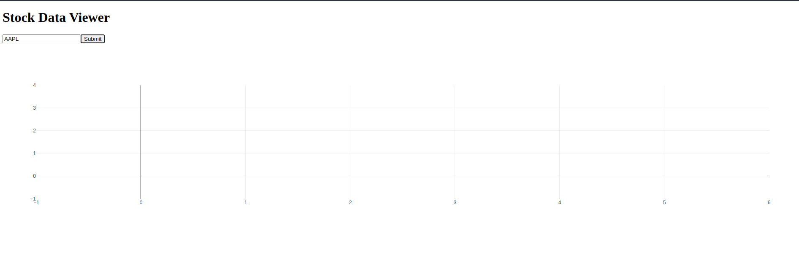

# stock-forecast

### Project Architecture:

1. **Frontend (Dash)**: 
   - Dash will serve as the frontend framework, handling the user interface where users can interact with the data, visualize stock trends, and make predictions.
   
2. **Backend (FastAPI)**: 
   - FastAPI will handle the API endpoints that fetch stock data from external APIs (e.g., Alpha Vantage, Yahoo Finance) or database. It will also serve as the endpoint for triggering the machine learning model to make predictions.

3. **Data Visualization (Plotly)**: 
   - Plotly, integrated with Dash, will be used to display time series stock data in interactive charts, including historical trends, moving averages, and predictions.

4. **Machine Learning (Forecasting)**:
   - Machine learning models such as ARIMA, Prophet, or even more complex models like LSTM can be used to forecast future stock prices based on historical data.
  

### Key Features:
- **Stock Data Visualization**: Interactive line charts of stock price history with options to choose different time frames (e.g., 1 month, 6 months, 1 year).
- **Trend Analysis**: Tools like moving averages, candlestick charts, or Bollinger Bands can be displayed for technical analysis.
- **Stock Forecasting**: Users can request future price predictions based on machine learning models.
- **User Interactivity**: Dash's interactive components (e.g., dropdowns, date selectors) can allow users to input their stock of interest, adjust timeframes, and view predictions.
